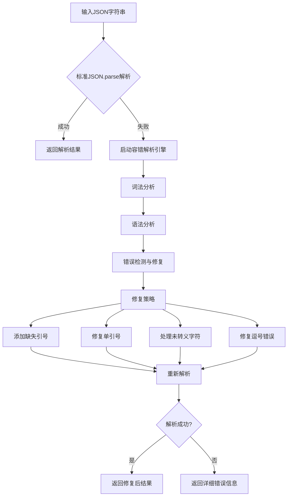

# JSON在线解析工具

一个功能完整的JSON在线解析工具，支持标准JSON解析和伪JSON字符串的容错解析。

## 功能特性

### 🎯 核心功能
- **标准JSON解析**：使用原生`JSON.parse()`进行快速解析
- **容错解析**：自动修复常见的JSON格式错误
- **实时解析**：输入时自动解析，即时反馈结果
- **格式化显示**：树形结构和格式化文本两种显示方式

### 🔧 容错能力
- ✅ 修复缺失引号的属性名和值
- ✅ 转换单引号为双引号
- ✅ 修复尾随逗号
- ✅ 处理未转义的特殊字符
- ✅ 详细的错误报告和修复建议

### 🎨 用户界面
- 响应式设计，支持移动端
- 树形结构可视化显示
- 实时错误计数和状态显示
- 双击自动格式化
- 键盘快捷键支持 (Ctrl+D)

## 使用方法

### 基本使用
1. 在左侧输入框中输入JSON字符串
2. 系统会自动实时解析
3. 查看右侧的解析结果和错误信息
4. 双击输入框可自动格式化JSON

### 支持的伪JSON格式

#### 缺失引号
```javascript
// 输入
{name: test, age: 25}

// 自动修复为
{"name": "test", "age": 25}
```

#### 单引号字符串
```javascript
// 输入
{name: 'test', data: 'value'}

// 自动修复为
{"name": "test", "data": "value"}
```

#### 尾随逗号
```javascript
// 输入
{"name": "test", "age": 25,}

// 自动修复为
{"name": "test", "age": 25}
```

#### 混合错误
```javascript
// 输入
{name: 'test', age: 25, data: [1,2,3,], active: true}

// 自动修复为
{"name": "test", "age": 25, "data": [1,2,3], "active": true}
```

## 技术实现

### 解析流程


### 文件结构
```
json_parse/
├── index.html          # 主页面
├── style.css           # 样式文件
├── json-parser.js      # JSON解析核心逻辑
├── app.js              # 应用逻辑和UI交互
└── README.md           # 项目说明
```

## 安全考虑

- 使用间接eval执行JavaScript代码，提高安全性
- 输入验证和错误处理
- 防止恶意代码注入

## 浏览器兼容性

- Chrome 60+
- Firefox 55+
- Safari 12+
- Edge 79+

## 开发说明

### 本地运行
直接使用浏览器打开 `index.html` 文件即可运行。

### 自定义扩展
可以扩展 `JSONParser` 类来添加更多的修复策略：

```javascript
// 添加新的修复方法
JSONParser.prototype.fixCustomError = function(str) {
    // 自定义修复逻辑
    return str;
};
```

## 许可证

MIT License

## 贡献

欢迎提交Issue和Pull Request来改进这个工具。